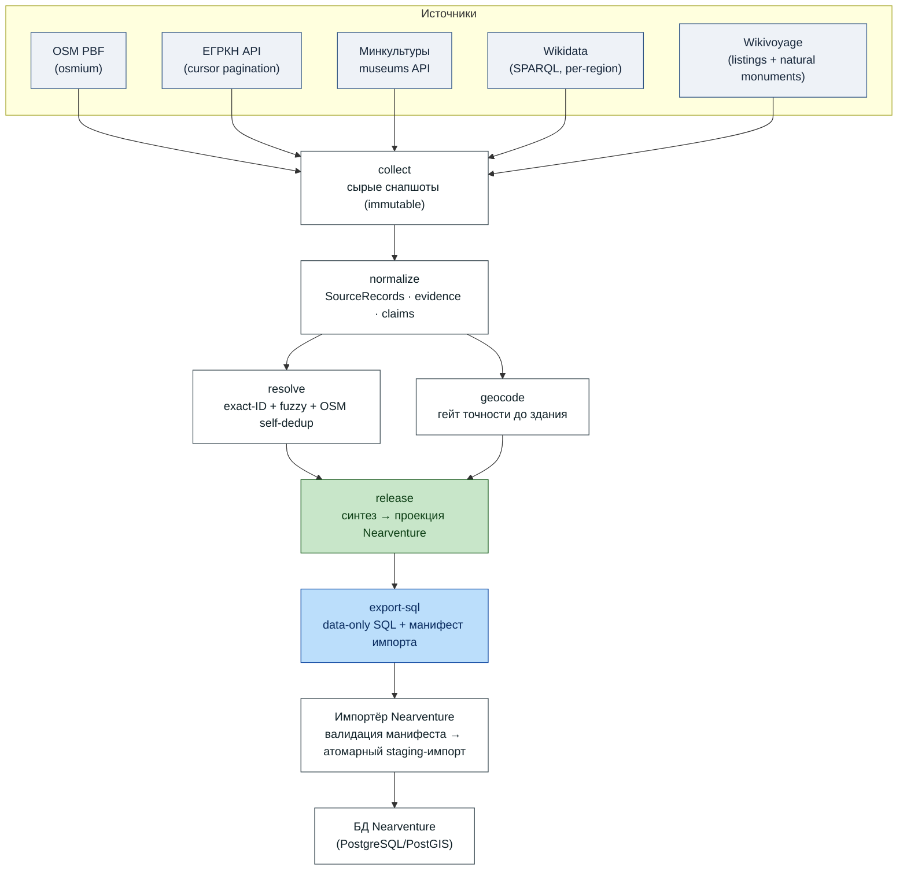
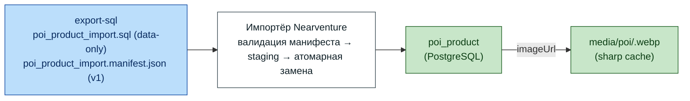

# POI Toolkit

Автономный file-first инструментарий на TypeScript для воспроизводимого сбора, синтеза и продуктового релиза POI (точек интереса). Собирает данные из OSM, ЕГРКН, Wikidata, Wikivoyage и реестра музеев Минкультуры — база данных не требуется, каждый этап записывает неизменяемые артефакты с контрольными суммами.

Nearventure — первый потребитель, но инструментарий нейтрален к источникам: другие продукты могут определять собственные профили категорий.

> **Граница интеграции.** Этот репозиторий — канонический **производитель** неизменяемого v1-бандла POI (data-only SQL + строгий манифест импорта). Только Nearventure помещает полученный бандл в свой доверенный корень и запускает свой импортёр; инструментарий никогда не вызывает инструменты потребителя и не пишет в его базу данных. См. [передачу от производителя](docs/nearventure-handoff.md).

## Конвейер



### Команды

```
collect → normalize → resolve → geocode → release → export-sql
```

| Этап | Вход | Выход | Что делает |
|---|---|---|---|
| `collect` | Territory JSON + PBF + API-ключи | `raw/*.ndjson` (immutable) | Загружает все источники, обрезает по территории |
| `replay-raw` | Завершённый source-ран + причина | Новая независимо созданная (exclusive-create) копия `raw/` + провенанс реплея | Переиспользует сохранённые сырые артефакты без сбора и доступа к сети |
| `normalize` | сырые снапшоты | `normalized/source-records.ndjson` | Разбор, классификация геометрии, извлечение evidence/claims |
| `resolve` | нормализованные записи | `resolution/candidates.ndjson` | Связывает записи: exact-ID, высокодостоверная нечёткая сверка, OSM self-dedup, близость музеев MKRF↔OSM |
| `geocode` | нормализованные ЕГРКН | `geocoded/geometry-evidence.ndjson` | Photon по умолчанию; явный выбор Nominatim/Yandex как провайдера и фолбэка, гейт точного совпадения адреса/литеры |
| `release` | normalized + resolution + geocoded | `release/entities.{geojson,parquet,gpkg,ndjson}` | Синтез полей, проекция 6 категорий Nearventure, гейты качества, атомарный бандл |
| `export-sql` | release-сущности | `reports/poi_product_import.sql` + `reports/poi_product_import.manifest.json` | Data-only upsert (детерминированный UUID) + строгий v1-манифест импорта; валидированный импорт выполняет импортёр Nearventure |

## Быстрый старт

```sh
corepack enable && pnpm install
pnpm typecheck && pnpm test && pnpm build

export MKRF_API_KEY=...        # ЕГРКН + музеи Минкульта
export PHOTON_URL=http://localhost:2322  # по умолчанию; локальный Photon
# Опционально, только при выборе через --provider/--fallback:
export NOMINATIM_URL=http://nominatim:8080
export GEOCODER_API_KEY=...    # Yandex, opt-in (максимум 1 000 вызовов как основной или фолбэк по умолчанию)
export POI_TOOLKIT_USER_AGENT="Your App/1.0 (contact: …)"

node packages/cli/dist/index.js collect   --territory kirov-oblast --run-id pilot
node packages/cli/dist/index.js normalize --territory kirov-oblast --run-id pilot
node packages/cli/dist/index.js resolve   --territory kirov-oblast --run-id pilot
# По умолчанию локальный Photon, без искусственного бюджета запросов.
node packages/cli/dist/index.js geocode   --territory kirov-oblast --run-id pilot
# Примеры явного провайдера/фолбэка:
node packages/cli/dist/index.js geocode   --territory kirov-oblast --run-id pilot --provider nominatim
node packages/cli/dist/index.js geocode   --territory kirov-oblast --run-id pilot --provider photon --fallback yandex
node packages/cli/dist/index.js release   --territory kirov-oblast --run-id pilot
node packages/cli/dist/index.js export-sql --territory kirov-oblast --run-id pilot
# → workspace/kirov-oblast/pilot/reports/poi_product_import.sql
# + workspace/kirov-oblast/pilot/reports/poi_product_import.manifest.json
```

### Docker

Инструкции по настройке/импорту/запуску Photon: [`docker/photon/README.md`](docker/photon/README.md).
Веса геокодера качаются с [photon.komoot.io/data/](https://photon.komoot.io/data/) (например, `russia-latest.tar`) —
это бесплатный массовый геокодинг при сборе POI.

```sh
docker build -t poi-toolkit .
docker run --rm -e MKRF_API_KEY -e GEOCODER_API_KEY \
  -v /path/to/pfo-latest.osm.pbf:/app/input/kirov-oblast.osm.pbf:ro \
  -v /path/to/workspace:/app/workspace \
  poi-toolkit collect --territory kirov-oblast --run-id pilot
```

Сбор **возобновляемый**: повторный запуск `collect` пропускает источники, снапшот которых уже существует.

## Готовые bundle (GitHub Releases)

Если нужен только импорт датасета в Nearventure, запускать весь пайплайн сбора
не обязательно — готовые **immutable v1-bundle** публикуются в
[GitHub Releases](https://github.com/stanleymarch/poi-toolkit/releases) этого репозитория.
Текущий release — `v0.1.0` (территория ПФО, 30 163 POI).

Каждый release содержит:

- `nearventure-<territory>-<tag>.bundle.tar.gz` — архив в layout импортёра
  (`reports/poi_product_import.sql`, `reports/poi_product_import.manifest.json`,
  `reports/collection-provenance.json`, `release/manifest.json`);
- `SHA256SUMS.txt` — SHA-256 каждого файла (дайджест SQL закреплён и внутри манифеста);
- `bundle.sha256` — SHA-256 всего архива.

Внутренний идентификатор прогона (`run.id`, например `pfo-slobodskoy-repair-v1`) остаётся
в манифесте как provenance и не обязан совпадать с именем release-файла.

Приём и импорт bundle описывает потребитель Nearventure:
[docs/data-refresh.md](https://github.com/stanleymarch/nearventure/blob/main/docs/data-refresh.md) → «Приём v1 bundle».

### Аттестация унаследованных сохранённых сырых артефактов

`pfo-v0.1` появился до внедрения захвата провенанса сбора, поэтому его нельзя передать напрямую в `replay-raw`. Не изменяйте этот старый ран, его сырые файлы или его релиз. Вместо этого создайте отдельный аттестованный source-ран из сохранённых байтов:

```sh
pnpm cli attest-legacy-raw --territory pfo --source-run-id pfo-v0.1 \
  --target-run-id pfo-v0.1-attested --reason "attest retained raw for current-rule replay"
```

Эта команда намеренно ограничена раном `pfo-v0.1` в территории `pfo` и отклоняет источник, уже имеющий непустой провенанс. Она независимо копирует каждый сохранённый обычный сырой файл (никогда не линкует его), проверяет SHA-256 источника и копии с детекцией мутации источника и записывает новый `collection-provenance.json` с пометками `attestation.legacy: true`, `attestation.reconstructed: true` и `sourceOrigin: "pfo-v0.1"` с указанием явной причины. Исходный ран остаётся read-only; провенанс не дополняется задним числом и не выдаётся за свежий сбор. Полученный аттестованный ран — валидный вход для `replay-raw`.

### Реплей сохранённых сырых артефактов

Чтобы перезапустить правила нормализации/релиза из проверенной сырой копии (например, для правки по Слободскому) без сбора и геокодирования, сначала создайте отдельный replay-ран:

```sh
pnpm cli replay-raw --territory pfo --source-run-id pfo-v0.2 \
  --target-run-id pfo-slobodskoy-corrected --reason "Slobodskoy corrected release"
```

Территория, ID source-рана и ID целевого рана должны быть каноническими идентификаторами (строчные буквы/цифры плюс `.`, `_`, `-`; без разделителей пути и traversal). Источник должен быть в статусе `completed`, сохранять сырые файлы и иметь валидный непустой провенанс сбора `sourceManifests`, чьи SHA-256 и размер снапшота точно совпадают с каждым сохранённым сырым файлом; цель не должна существовать. `replay-raw` отклоняет выходы за пределы workspace через символические ссылки, symlinked-сырые артефакты, hardlinked-файлы источника и мутацию источника во время чтения/копирования. Он стримит независимо созданные (exclusive-create) скопированные байты (никогда не hardlink), сверяет хэш и размер каждой цели с провенансом источника, записывает верифицированные артефакты плюс source-ран, метку времени и причину в `reports/collection-provenance.json` и помечает манифест рана как replay. Копии независимы, но не являются immutable-файлами. Сетевой сбор не выполняется и свежий захват не утверждается. Продолжайте с `normalize`, `resolve` и `release`; не запускайте `geocode`, если новые геокодирования не одобрены намеренно.

## Определение территории

```jsonc
// territories/kirov-oblast.json
{
  "slug": "kirov-oblast",
  "egrkn": { "region": "Кировская область" },
  "osm": { "pbf": "input/kirov-oblast.osm.pbf", "bbox": [46, 56.3, 55, 61] },
  "mkrf": { "clipBbox": [46, 56.3, 55, 61] },
  "wikidata": { "regions": ["Q5387"] },
  "wikivoyage": { "pages": ["Киров", "Слободской", …] },
  "wikivoyageNature": { "pages": ["Природные памятники России/Кировская область"] }
}
```

Для мультирегионных территорий (например, весь ПФО) добавьте `egrkn.regions: [...]` (14 субъектов).

## Как работает обогащение

**Категории:** Источниково-нейтральные фасеты → 6 категорий Nearventure (`heritage | monument | sights | religion | nature | museum`). ЕГРКН `objectType` «Памятник» — это правовой уровень, а не тип: классификация **учитывает название** (церковь→religion, Дом→heritage).

**Фото:** Медиа-claims сохраняют исходный URL и провенанс; инструментарий не скачивает медиа. Кандидаты Commons резолвятся через API Commons и допускаются только тогда, когда метаданные содержат лицензию (с атрибуцией). Медиа MKRF и ЕГРКН несут настроенные условия открытых данных Министерства и атрибуцию. Произвольные HTTP-URL из тегов OSM — лишь upstream-ссылки без верифицированной лицензии, а не проверенное переиспользуемое медиа — и ранжируются последними. Потребитель сам решает, можно ли какой-либо URL загружать, кэшировать или распространять, и сам применяет SSRF-защиту и собственные механизмы контроля переиспользования/лицензий.

**Описания:** Выбирается один исходный текст (без ИИ, без склейки). Предпочтителен русский; гейт типовой совместимости отклоняет несоответствующие описания. Каждое описание несёт источник + лицензию.

**Геометрия:** Родная OSM сохраняется; доверенные автономные источники (MKRF/ЕГРКН) принимаются с объектным гейтом точности; геокоды принимаются **только** с точностью до здания. Locality/street/unknown никогда не публикуются. Вхождение в территорию — через полигоны исключения соседних регионов.

**Дедупликация:** OSM self-dedup (node+way в пределах 30 м → одна сущность); точные межисточниковые связи требуют негенерического названия, ≤30 м и отсутствия конфликта адресов. Близость музеев MKRF↔OSM (разные названия, одно учреждение → связываются).

**Оценка качества:** 0–100 по 5 измерениям (структурная целостность, покрытие обогащения, достоверность связей, полнота провенанса, качество дедупликации). Записывается в `reports/quality-score.json`.

## Интеграция с Nearventure



Команда `export-sql` выдаёт **два артефакта**:

1. `reports/poi_product_import.sql` — **data-only** фрагмент (`nearventure-poi-product-sql-v1`): ровно один `INSERT … ON CONFLICT (poi_uuid) DO UPDATE` на сущность, в детерминированном порядке UUID (sha256 от ID сущности). Без `BEGIN`/`COMMIT`, без DDL, без psql-метакоманд.
2. `reports/poi_product_import.manifest.json` — строгий v1-манифест (фиксированные канонические пути, счётчики, SHA-256-хэши, ревизия инструментария, окно версий импортёра, провенанс, атрибуция источников).

Бандл передаётся как неизменяемые байты в trusted-root-процесс Nearventure. Инструментарий **не** копирует его в этот корень, не вызывает импортёр и не пишет в базу потребителя. **Никогда не применяйте SQL напрямую** — прямой `psql -f` и ручные staging-скрипты замены запрещены. [Передача от производителя](docs/nearventure-handoff.md) определяет требуемые дайджесты бандла и порядок; канонической для валидации и импорта на стороне потребителя является [процедура обновления данных Nearventure](https://github.com/stanleymarch/nearventure/blob/main/docs/data-refresh.md).

Потребитель может загружать `image_url`, конвертировать в WebP и кэшировать (Nearventure так и делает); это вне зоны инструментария. Перед любой загрузкой, кэшированием или распространением потребитель обязан применить SSRF-защиту и принять собственное решение о переиспользовании/лицензии. В частности, произвольный внешний URL из тега OSM — это непроверенная upstream-ссылка, а не передача прав на переиспользование.

## Дорожная карта

Инструментарий сегодня — прежде всего сборщик и синтезатор данных. Следующее направление развития — не только собирать данные, но и **помогать их обогащать**, оставаясь в рамках безопасного послевого провенанса (provenance на уровне отдельных полей):

- **Публикация фактических расписаний и контактов музеев из MKRF/Минкультуры** там, где в OSM их нет. Реестр музеев Минкульты уже содержит контакты и режимы работы; инструментарий может готовить предложения по обогащению OSM (notes/tags-патчи) или публиковать сверенные данные отдельным датасетом — без перезаписи чужих данных и с сохранением источника каждого поля.
- **Генерация alt-name (алиасов) для сматченных POI** при высокой достоверности сопоставления. Когда `resolve` связывает записи разных источников с высокой уверенностью (exact-ID или строгий fuzzy-гейт), названия из связанных источников можно безопасно публиковать как алиасы сущности — каждый со своим провенансом.
- **Обнаружение и предложение исправлений рассинхронов**: расхождения координат, адресов и категорий между OSM, ЕГРКН и MKRF → отчёты с приоритетами для правок в OSM (а не автоматическая перезапись).
- **Дозаполнение отсутствующих полей из доверенных источников**: например, официальные наименования из ЕГРКН для объектов OSM без названия, если геометрия и тип согласованы.
- **Публичные «пробелы покрытия»**: отчёты, где по территории или категории данные бедны (нет фото, описаний, контактов), чтобы направлять краудсорсинг и полевые съёмки.

Общий принцип неизменен: инструментарий предлагает и публикует обогащения с по-полевым провенансом и лицензией; перезапись данных в OSM остаётся за сообществом OSM, а доверенная запись в базу потребителя — за импортёром Nearventure.

### Насыщение данными с помощью AI-агентов

Отдельное направление — подготовка **предложений по обогащению** с помощью локальных/внешних LLM-агентов, при этом агент никогда не пишет напрямую ни в OSM, ни в базу потребителя:

- **Структурирование свободного текста**: из описаний Wikivoyage/MKRF агент извлекает расписания, контакты, часы работы, особенности доступа — как кандидатов-факты с цитатой на исходный абзац и провенансом поля.
- **Агентные проверки согласованности**: сверить адрес/координаты/часы между OSM, ЕГРКН и сайтом музея; расхождения — в отчёт с уверенностью, а не автоправка.
- **Генерация alt-name по связанным записям** при высокоуверенном `resolve`-сопоставлении (см. ниже), с лицензией каждого исходного поля.
- **Аудит кандидатов перед публикацией**: детерминированные гейты (тип, геометрия, длина, лицензия) проходят всегда; «умные» правки агента — только через явный dry-run/рецензию, никогда молча.
- **Конфиденциальность**: агент получает только публичные открытые данные; никакие ключи/токены не передаются провайдерам.

### Улучшение дедупликации

Дедуп сегодня — exact-ID, строгий fuzzy-гейт и OSM self-dedup. Дальнейшие направления:

- **Кластерный мэтч по геометрии и времени**: POI, стоящие в разных источниках на одних координатах с совместимыми типами/датами, образуют кандидатов в кластеры, а не попарные сравнения (лучше для масштаба ПФО).
- **Фаззинг по названиям с учётом контекста**: алиасы, региональные варианты написания, сокращения и транслитерации — с порогами уверенности и обязательной проверкой по геометрии.
- **Мэтч «музей ↔ здание» через близость и тип**: MKRF-музей и OSM-здание рядом с совместимым типом — кандидат, подтверждаемый адресом или расписанием.
- **Метрики качества дедупа**: precision/recall-отчёт по случайной выборке и по «сложным» кластерам, чтобы улучшение не приносило ложных слияний.
- **Взаимное согласование resolve и обогащения**: сматченные записи — основа для alt-name и дозаполнения полей; обогащение не создаёт новых сущностей, пока дедуп не подтвердил сопоставление.

## Пакеты

| Пакет | Роль |
|---|---|
| `core` | Zod-контракты, территории, манифесты, point-in-polygon |
| `source-osm` | osmium-извлечение из PBF + парсер GeoJSON-seq |
| `source-egrkn` | cursor-API ЕГРКН (мультирегион, дедуп) |
| `source-mkrf` | музеи Минкультуры (обрезка по всей России) |
| `source-wikidata` | SPARQL по регионам |
| `source-wikivoyage` | listings MediaWiki + природные памятники |
| `normalize` | SourceRecords, evidence геометрии, field claims |
| `resolver` | exact-ID + fuzzy + OSM self-dedup + близость MKRF |
| `geocode` | Photon по умолчанию плюс адаптеры Nominatim/Yandex, фолбэк и адресные гейты |
| `taxonomy` | источниково-нейтральные фасеты + детекция шума |
| `media` | резолюция Commons + атрибуция |
| `synthesis` | детерминированный выбор полей из многих источников |
| `profiles-nearventure` | проекция в 6 категорий |
| `quality` | профилирование источников + оценка качества (0–100) |
| `geography` | OSM-адресный индекс + геометрическая дедупликация/кластеризация (containment), привязка субъектов ПФО |
| `exporters` | атомарные GeoJSON/Parquet/GPKG/NDJSON + SQL-экспорт |
| `cli` | все команды |

## Документация

- [Архитектура (EN)](docs/ARCHITECTURE.md) — как устроен каждый механизм, схемы, стратегия медиа
- [Архитектура (RU)](docs/ARCHITECTURE.ru.md) — русская версия; контракт экспорта v1 и граница с Nearventure
- [Передача Nearventure](docs/nearventure-handoff.md) — граница производителя, неизменяемый v1-бандл, идентификаторы и порядок релиза
- [Граница релиза и воспроизводимости](docs/release-reproducibility.md) — проверки источников, неизменяемые доказательства передачи, охват SBOM/провенанса
- [Обновление данных Nearventure](https://github.com/stanleymarch/nearventure/blob/main/docs/data-refresh.md) — канонический trusted-root и процедура импорта у потребителя
- [Свидетельства релиза Nearventure](https://github.com/stanleymarch/nearventure/blob/main/docs/release-evidence/beta-0.1-acceptance.md) — датированные доказательства приёмки потребителем
- [Верификация по Кирову](docs/core-v2-final-verification.md) — QA конвейера + выборочный аудит
- [Укрепление качества](docs/quality-hardening.md) — правила качества и ограничения обновлений каталога
- [Сравнение по ПФО](docs/pfo-comparison.md) — против унаследованного Python-коллектора
- [Примечания к релизу v0.1](docs/v0.1-release-notes.md) — исторический артефакт и запись о восстановленном бандле
- [План v0.2](docs/v0.2-release-notes.md) — исторический плановый документ; не будущий чек-лист приёмки

### Связанные репозитории

| Репозиторий | Роль |
|---|---|
| [poi-toolkit](https://github.com/stanleymarch/poi-toolkit) | Этот репозиторий: каноническая подготовка и экспорт POI |
| [nearventure](https://github.com/stanleymarch/nearventure) | Потребитель версионированного экспорта: импортёр с валидацией манифеста, карта и маршруты |

## Требования

Node 22, pnpm, osmium-tool (для OSM PBF). Dockerfile включает osmium + GDAL (GDAL опционален — GeoPackage деградирует мягко).

## ИИ-ассистенты

Значительная часть poi-toolkit написана **с помощью** языковых
моделей, не только человеком:

- **GLM-5.2** (Zhipu AI) — планирование архитектуры
- **GLM-4.7** (Zhipu AI) — реализация
- **DeepSeek 4 Flash** (DeepSeek) — реализация
- **GPT-5.6** (OpenAI) — реализация, укрепление безопасности и подготовка релиза

## Автор

[staniverse](https://t.me/staniverse)
